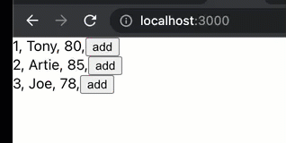
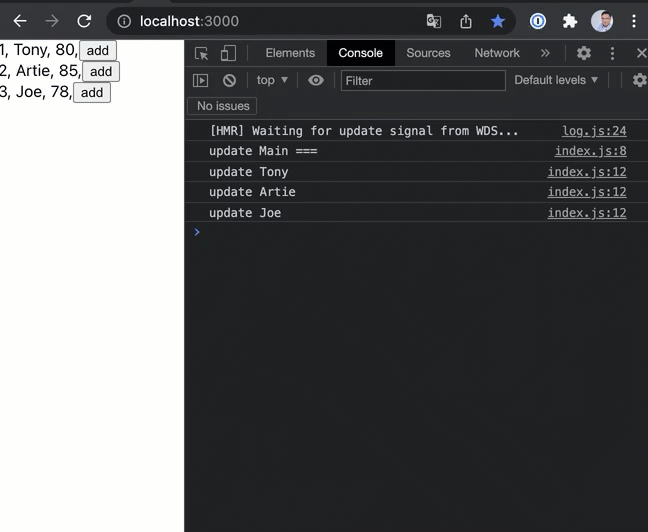
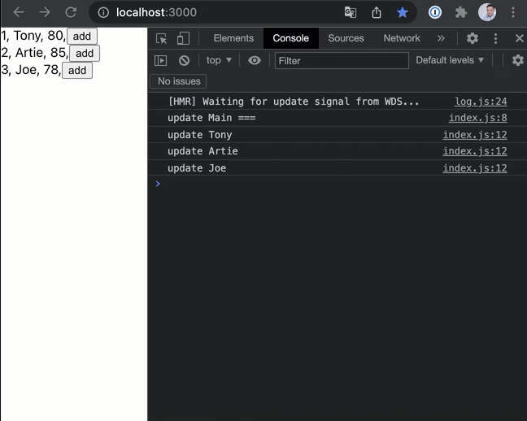
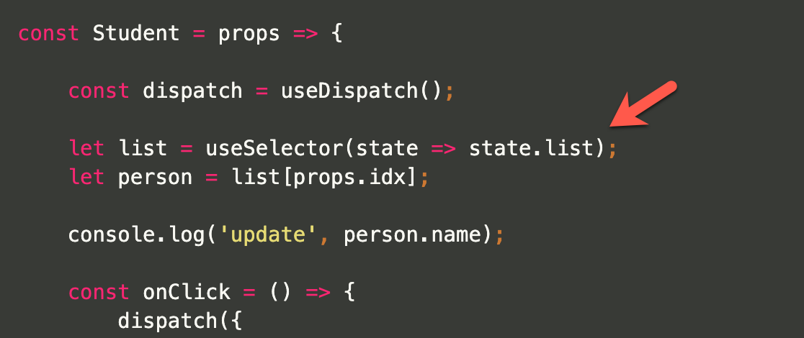

# Redux - avoid rendering everything

by [Arthur Fan](mailto:fanartie@gmail.com),  July 2020

Let’s talk about common mistakes with using Redux.
We are going to create a simple Redux project as follows.



### _The code below looks good but needs to be corrected!_

The store

```jsx
import { createStore } from 'redux';
import reducer from "./reducer";

const store = createStore(
    reducer
);

export default store;
```


The initState
```jsx
module.exports = {
    list: [
        {id: 1, name: 'Tony',   score: 80},
        {id: 2, name: 'Artie',  score: 85},
        {id: 3, name: 'Joe',    score: 78},
    ]
}
```

The reducer
```jsx
import initState from './initState';

const reducer = (state=initState, action) => {

    switch (action.type) {
        case 'add':
            let newList = JSON.parse(JSON.stringify(state.list));
            newList[action.idx].score += 1;
            return {
                ...state,
                list: newList
            };
        default:
            return state;
    }
}

export default reducer;
```


The main code

```jsx
import {useSelector} from "react-redux";
import Student from '../Student';

const Main = () => {

    let list = useSelector(state => state.list);

    console.log('update Main ===');

    return (
        <div>
            {list.map((i,idx)=>{
                return (
                    <Student key={i.id} idx={idx}/>
                )
            })}
        </div>
    );
}

export default Main;
```

The Student component
```jsx
import { useDispatch, useSelector } from 'react-redux';
import { Fade } from "react-awesome-reveal";

const Student = props => {

    const dispatch = useDispatch();

    let list = useSelector(state => state.list);
    let person = list[props.idx];

    console.log('update', person.name);

    const onClick = () => {
        dispatch({
            type: 'add',
            idx: props.idx
        });
    }

    let key = [person.id, person.score].map(String).join(':');

    return (
        <Fade key={key}>
            <div>
                {person.id}, {person.name}, {person.score},
                <button onClick={onClick}>add</button>
            </div>
        </Fade>
    );
}

export default Student;
```

### _What's wrong with the code?_


Let's debug with console log (Test-1)



### _We should NOT reload the whole "Main" when clicking on a single person!_

How to fix it? If we want to reference the initState "list" at the "Main".

Simply use "store.getState()" to load the data.

We should avoid using the "Main(root)" as an observer because any update to the root may force rendering all the children.

```jsx
import store from '../../store';
import Student from '../Student';

const Main = () => {

    let list = store.getState().list;

    console.log('update Main ===');

    return (
        <div>
            {list.map((i,idx)=>{
                return (
                    <Student key={i.id} idx={idx}/>
                )
            })}
        </div>
    );
}

export default Main;
```

### _We have fixed the issue. The "Main" is only rendering once now!_
### _But why it still renders all the students when we click on a single person?_

(Test-2)



We understood it was attempting to overwrite an immutable state, and it used a quick-dirty solution as "JSON.parse(JSON.stringify())", which allocates new memory for the value and then every array element will be considered as 'updated'.  

  

How can we reduce the immutable state by updating only one array element?

Introducing the 'immer' library.
[https://www.npmjs.com/package/immer](https://www.npmjs.com/package/immer)
```bash
yarn add immer
```

The reducer with using 'immer'

```jsx
import initState from './initState';
import immer from 'immer';

const reducer = (state=initState, action) => {

    switch (action.type) {

        case 'add':
            return immer(state, draft =>{
                draft.list[action.idx].score += 1;
            })

        default:
            return state;
    }
}

export default reducer;
```

### _Awesome! But it doesn't fix the issue._

Since only one student is updated, it will still consider the whole array is updated. 

(Test-3)



Each student should only subscribe to their element instead of the entire array.

```jsx
let person = useSelector(state => state.list[props.idx]);
```

The new code...
```jsx
import { useDispatch, useSelector } from 'react-redux';
import { Fade } from "react-awesome-reveal";

const Student = props => {

    const dispatch = useDispatch();

    let person = useSelector(state => state.list[props.idx]);

    console.log('update', person.name);

    const onClick = () => {
        dispatch({
            type: 'add',
            idx: props.idx
        });
    }

    let key = [person.id, person.score].map(String).join(':');

    return (
        <Fade key={key}>
            <div>
                {person.id}, {person.name}, {person.score},
                <button onClick={onClick}>add</button>
            </div>
        </Fade>
    );
}

export default Student;
```

(Test-4)


### _Finally, it's running correctly now!_

#### _Questions for you..._

When you click on a person, you might have noticed the "react-awesome-reveal" used for the "Fade" effect. Please look carefully at the (Test-1). Why is it only "Fading" on one person since we have proved that all students are rendered?

思考題, 
你可以在 (Test-1) 動畫看到, 我們有使用 "Fade" 效果, 既然我們都已經證明, 所有學生都被 rendered 了, 那為什麼僅有一人 會出現 Fade 效果呢 ?


