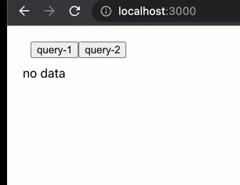
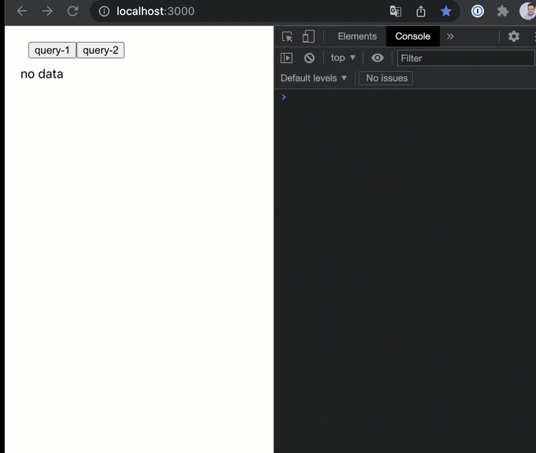

# Redux - array or object ?
by [Arthur Fan](mailto:fanartie@gmail.com),  Aug 2020

When API returns array of update, should we refresh the state of array ? or we should only render the item which is 'updated' or 'new inserted' ?

The sample project



the Main.js
```jsx
import Query from '../Query';
import Output from '../Output';

const Main = () => {
    console.log('update Main ===');
    return (
        <div style={{margin:'20px'}}>
            <Query/>
            <Output/>
        </div>
    );
}

export default Main;
```

the store.js
```jsx
import { createStore } from 'redux';

import reducer from "./reducer";

const store = createStore(
    reducer
);

export default store;

```

the initState.js
```jsx
module.exports = {
    list: []
}
```

the reducer.js
```jsx
import initState from './initState';
import immer from 'immer';

const reducer = (state=initState, action) => {

    switch (action.type) {

        case 'apiResult':
            return immer(state, draft =>{
                draft.list = action.result
            })

        default:
            return state;
    }
}

export default reducer;

```

the Query.js - I temporarily hard-coded to simulate API return 
```jsx
import {useDispatch} from "react-redux";

const Query = () => {

    const dispatch = useDispatch();
    console.log('update Query ===');

    const query1 = () => {
        dispatch({
            type: 'apiResult',
            result: [
                {id: 1, name: 'Tony',   score: 80},
                {id: 2, name: 'Artie',  score: 85},
                {id: 3, name: 'Joe',    score: 78},
                {id: 5, name: 'David',  score: 35},
            ]
        })
    }

    const query2 = () => {
        dispatch({
            type: 'apiResult',
            result: [
                {id: 1, name: 'Tony',   score: 66},
                {id: 2, name: 'Artie',  score: 85},
                {id: 3, name: 'Joe',    score: 99},
                {id: 4, name: 'Jeff',   score: 93},
                {id: 5, name: 'David',  score: 35},
            ]
        })
    }

    return (
        <div style={{margin:'10px'}}>
            <button onClick={query1}>query-1</button>
            <button onClick={query2}>query-2</button>
        </div>
    );
}

export default Query;
```

the Output.js
```jsx
import Student from '../Student';
import {useSelector} from "react-redux";

const Output = () => {

    let list = useSelector(state => state.list);

    console.log('update Output ===');

    if (list.length===0) {
        return (
            <div>
                no data
            </div>
        )
    } else {
        return (
            <div>
                {list.map((i,idx)=>{
                    return (
                        <Student key={i.id} idx={idx}/>
                    )
                })}
            </div>
        );
    }
}

export default Output;
```

the Student.js
```jsx
import { useSelector } from 'react-redux';
import { Fade } from "react-awesome-reveal";

const Student = props => {

    let person = useSelector(state => state.list[props.idx]);
    console.log('update', person.name);

    let key = [person.id, person.score].map(String).join(':');

    return (
        <Fade key={key}>
            <div style={{margin:'10px'}}>
                {person.id}, {person.name}, {person.score}
            </div>
        </Fade>
    );
}

export default Student;
```

What's wrong ? Let's take a look



We don't need to re-render for the "Artie" and "David" because their data is not updated.

Because we replace the entire array to the state, so why every student is re-rendered.

```jsx
        case 'apiResult':
            return immer(state, draft =>{
                draft.list = action.result
            })

```

The API result is possible update of add/change/delete, we can't judge update by its position, we should look into the data and use object instead.

at the Redux state, we are going to convert the array "list" into object
```jsx
        list: [
                {id: 1, name: 'Tony',   score: 80},
                {id: 2, name: 'Artie',  score: 85},
                {id: 3, name: 'Joe',    score: 78},
                {id: 5, name: 'David',  score: 35},
            ]
```
use the 'id' as key
```jsx
        list: {
            1: {id: 1, name: 'Tony',   score: 80},
            2: {id: 2, name: 'Artie',  score: 85},
            3: {id: 3, name: 'Joe',    score: 78},
            5: {id: 5, name: 'David',  score: 35},
        }   
}           
```

We changed the initState.js 

```jsx
module.exports = {

    list: {}

}
```

Since list is no longer an array, we should update the Output.js, from this

```jsx
             {list.map((i,idx)=>{
                    return (
                        <Student key={i.id} idx={idx}/>
                    )
                })}
```

