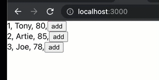
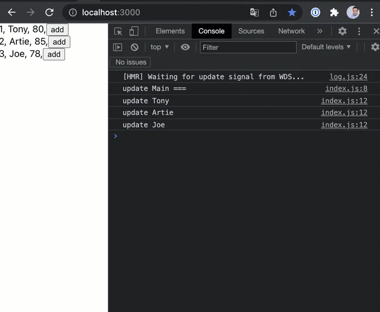
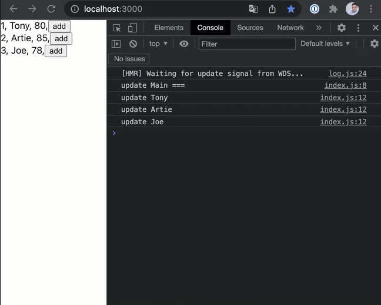
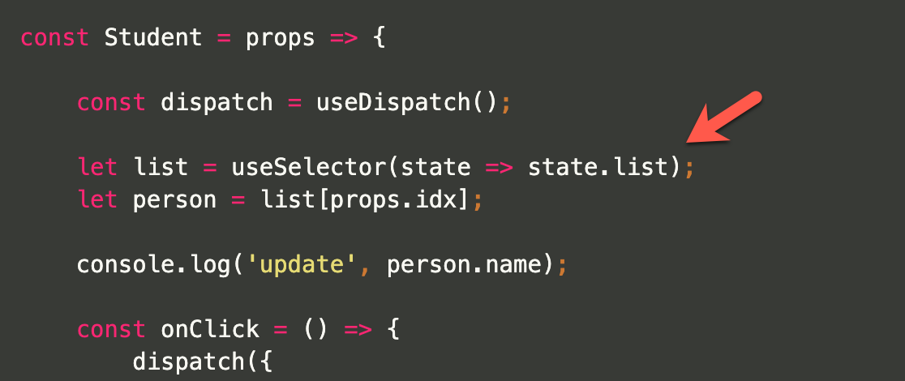

# Redux - avoid rendering everything

Let's talk about common mistakes with using Redux.

We are going to create a simple Redux project as following...



### _The codes below look good, but something are wrong!_

The store

```jsx
import { createStore } from 'redux';
import reducer from "./reducer";

const store = createStore(
    reducer
);

export default store;
```


The initState
```jsx
module.exports = {
    list: [
        {id: 1, name: 'Tony',   score: 80},
        {id: 2, name: 'Artie',  score: 85},
        {id: 3, name: 'Joe',    score: 78},
    ]
}
```

The reducer
```jsx
import initState from './initState';

const reducer = (state=initState, action) => {

    switch (action.type) {
        case 'add':
            let newList = JSON.parse(JSON.stringify(state.list));
            newList[action.idx].score += 1;
            return {
                ...state,
                list: newList
            };
        default:
            return state;
    }
}

export default reducer;
```


The main code

```jsx
import {useSelector} from "react-redux";
import Student from '../Student';

const Main = () => {

    let list = useSelector(state => state.list);

    console.log('update Main ===');

    return (
        <div>
            {list.map((i,idx)=>{
                return (
                    <Student key={i.id} idx={idx}/>
                )
            })}
        </div>
    );
}

export default Main;
```

The Student component
```jsx
import { useDispatch, useSelector } from 'react-redux';
import { Fade } from "react-awesome-reveal";

const Student = props => {

    const dispatch = useDispatch();

    let list = useSelector(state => state.list);
    let person = list[props.idx];

    console.log('update', person.name);

    const onClick = () => {
        dispatch({
            type: 'add',
            idx: props.idx
        });
    }

    let key = [person.id, person.score].map(String).join(':');

    return (
        <Fade key={key}>
            <div>
                {person.id}, {person.name}, {person.score},
                <button onClick={onClick}>add</button>
            </div>
        </Fade>
    );
}

export default Student;
```

### _What's wrong with the code?_


Let's debug with console log



### _We should NOT reload the whole "Main" when clicking on single person!_

How to fix it? if we really want to reference the initState "list" at the "Main".

Simply use "store.getState()" to load the data.

We should avoid using the "Main(root)" as observer, because any update will force render all the children.

```jsx
import store from '../../store';
import Student from '../Student';

const Main = () => {

    let list = store.getState().list;

    console.log('update Main ===');

    return (
        <div>
            {list.map((i,idx)=>{
                return (
                    <Student key={i.id} idx={idx}/>
                )
            })}
        </div>
    );
}

export default Main;
```

### _Looks like we have fixed the issue, the "Main" only rendering once now!_
### _But, why all the students are still rendered if we only click on single person?_



Because the entire array is updated by the quick-dirty way as "JSON.parse(JSON.stringify())", which allocates the new memory for the array and then every element will be considered as 'updated'.  

(We understood it was attempting to overwrite an immutable variable.)  

How can we reduce the immutable state with updating only one element of array ?

Introducing the 'immer' library.
[https://www.npmjs.com/package/immer](https://www.npmjs.com/package/immer)
```bash
yarn add immer
```

The reducer with using 'immer'

```jsx
import initState from './initState';
import immer from 'immer';

const reducer = (state=initState, action) => {

    switch (action.type) {

        case 'add':
            return immer(state, draft =>{
                draft.list[action.idx].score += 1;
            })

        default:
            return state;
    }
}

export default reducer;
```

### _Awesome! But, it doesn't fix the issue._

Because each student is still subscribe with the 'entire' array of update, and why any element change will be considered as "array is updated".



Each student should only subscribe to his element instead of the entire array.

```jsx
let person = useSelector(state => state.list[props.idx]);
```

The new code...
```jsx
import { useDispatch, useSelector } from 'react-redux';
import { Fade } from "react-awesome-reveal";

const Student = props => {

    const dispatch = useDispatch();

    let person = useSelector(state => state.list[props.idx]);

    console.log('update', person.name);

    const onClick = () => {
        dispatch({
            type: 'add',
            idx: props.idx
        });
    }

    let key = [person.id, person.score].map(String).join(':');

    return (
        <Fade key={key}>
            <div>
                {person.id}, {person.name}, {person.score},
                <button onClick={onClick}>add</button>
            </div>
        </Fade>
    );
}

export default Student;
```


### _Finally, it's running correctly now!_

Questions for you...

1. If you noticed the "react-awesome-reveal" library that shows the "Fade" effect when we click on the person. Why does the first GIF (original code with bug) look like running correctly, only one person with "Fading" effect although every student is rendered ?

2. What's the influence if we never fix the bug?

3. If we really want to 'reload' the entire array (ex, API returns entire array of update), are we able to only render the item which is 'updated' or 'new inserted' without rendering the whole list ?


